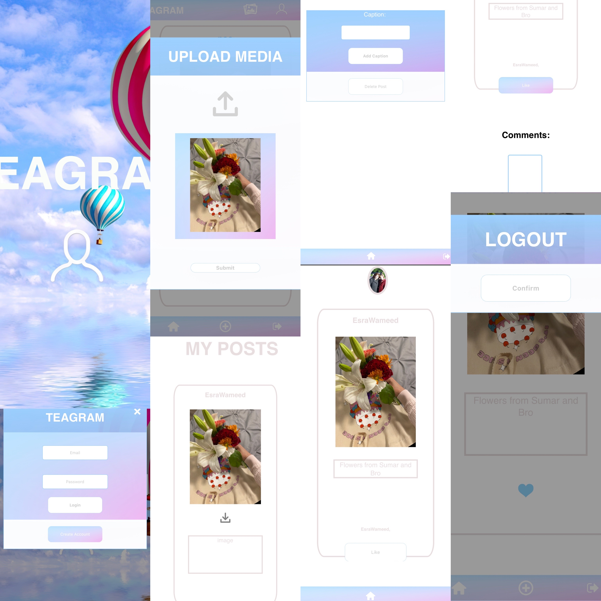

<h1><picture>
  
</picture>TEAGRAM</h1>

## Description
https://tea-gram.herokuapp.com/

As technology contiues to grow, people of all age groups have become more dependant on social media platforms to engage with others. TEAGRAM empowers its users through its networking technology, allowing them to develop meaningfull new connections and friendships. Users can truly stand out, as TEAGRAM gives its users the capability to build a platform, share their knowledge and create captivating content. Furthermore, users can grow their business with TEAGRAM as they share their brand with TEAGRAM's diverse community!
## Navigation
- [Features](#features)
- [Technologies](#technologies)
- [Deployement](#deployement)
- [Images](#images)
- [Credits](#credits)
- [License](#license)

## Features
- When clicking on the login icon, users can create an account, or login to an existing account with TEAGRAM
- Once logged in, the TEAGRAM coomunities posts are displayed on the users feed
- When clicking on a post within the feed, users can like, comment, and view the users post
- Through clicking on the gallery icon, users are directed to the gallery page, displaying all their posts
- When clicking on a post within the gallery page, users can add a caption or delete an existing post of theirs
- Users can conveniently create a new post by clicking the add icon, where a modal will allow them to upload a media file by clicking on the upload icon
- Through clicking the profile icon, users can view their profile details and change their profile picture by clicking their current profile picture
- When clicking the upload profile picture, and selecting an image, a picture preview is displayed.
- Users can easily logout by clicking the logout icon 
- TEAGRAM is fully responsive and intended for mobile use!

## Technologies

<h2><picture>
  
</picture>HTML <picture>
  
</picture>CSS <picture>
  
</picture>JavaScript</h2>
<h2><picture>
  
</picture>Express.js Node.js <picture>
  
</picture>MYSQL</h2>
<h2>MVC Dotenv Bcrypt</h2>

## Deployement

### Requirements:
- **JawsDB MySQL** 
- **Node.js** 

## Images
### Mobile view

## Credits

### Esra Al-abduljabar
Link to Esra's [GitHub Profile](https://github.com/EsraWameed)

### Abed Hasan
Link to Abed's [GitHub Profile](https://github.com/abedhasan79)

### Trishane Wijeyawickrema
Link to Trishane's [GitHub Profile](https://github.com/Trishaneww)

## License

Copyright (c) 2022 Esra Al-Abduljabar, Abed, Trishane

Permission is hereby granted, free of charge, to any person obtaining a copy
of this software and associated documentation files (the "Software"), to deal
in the Software without restriction, including without limitation the rights
to use, copy, modify, merge, publish, distribute, sublicense, and/or sell
copies of the Software, and to permit persons to whom the Software is
furnished to do so, subject to the following conditions:

The above copyright notice and this permission notice shall be included in all
copies or substantial portions of the Software.

THE SOFTWARE IS PROVIDED "AS IS", WITHOUT WARRANTY OF ANY KIND, EXPRESS OR
IMPLIED, INCLUDING BUT NOT LIMITED TO THE WARRANTIES OF MERCHANTABILITY,
FITNESS FOR A PARTICULAR PURPOSE AND NONINFRINGEMENT. IN NO EVENT SHALL THE
AUTHORS OR COPYRIGHT HOLDERS BE LIABLE FOR ANY CLAIM, DAMAGES OR OTHER
LIABILITY, WHETHER IN AN ACTION OF CONTRACT, TORT OR OTHERWISE, ARISING FROM,
OUT OF OR IN CONNECTION WITH THE SOFTWARE OR THE USE OR OTHER DEALINGS IN THE
SOFTWARE.